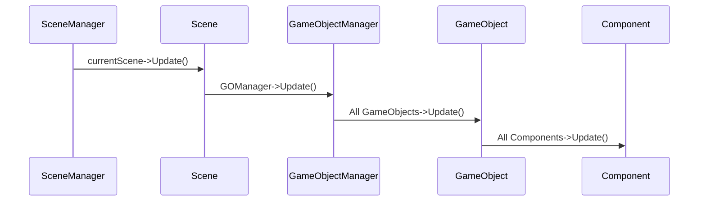

During my second year at The Game Assembly, my team and I developed a custom game engine named **Kitty Engine** for a total of 4 group projects. This page goes more in depth on some of my contributions on the engine.
Full project can be found here: [Kitty Engine source code](https://github.com/OlleKReutercrona/KittyEngine/tree/main/KittyEngine)

> **[Disclaimer]** The source code was moved from a private perforce server to github so all previous commit history has thus been deleted. On the other hand there is a game project in the repo. The game can be played here: [Intergalactic Ball Throwing Championship With Friends ツ](https://kapten-h.itch.io/igbtcwf)

## GameObject Component System

When we first started building the engine, I took on the responsibility of writing the code that handles the logic side of the game. This includes handling scenes, updating objects and running game specific code in a structured way. After some researching and discussions in the team I took the decision to build a GameObject/Component system that is familiar to Unitys scripting interface. I chose to design it this way since we all had previous experience with Unity and would therefor feel familiar and intuitive. 

This part of the engine works as following: an object called SceneManager owns all scenes of the game and is responsible to run the current scenes update functions, changing scene and lastly loading a new scene from file.  

The Scene object contains everything that an instance of a level should have, this includes a GameObject Manager, an interface to the collision system and a navmesh. 

GameObject Manager owns and runs all the GameObjects of the scene. These objects are the game specific objects that needs to be updated frequently. The manager handles the order of execution of the GameObjects functions and is also the interface for GameObjects to be able to reach other GameObjects and its Components. 

The GameObject is a more complex class. Although it has some member variables to its name it is the member functions that is the core of the class together with its components. These functions all have a very specific purpose that is used to call the function with the same name in the GameObjects Components. 

The Component is the bottom of the pyramid. Just as in Unity these objects have a certain purpose defined by the programmer. Together with GameObjects, Components defines the object it is owned by. A PlayerController could for instance have a PlayerComponent, ColliderComponent and a MeshComponent to define itself and its behaviours. 

    class Component
    {
        public:    
            virtual ~Component() {};
    
            virtual void SetData(void* aDataObject = nullptr) { aDataObject; };
            virtual void DefaultData() { __noop; }
    
            inline virtual void SetActive(const bool aValue)
            {
                isActive = aValue;
    
                isActive ? OnEnable() : OnDisable();
            };
    
            inline bool IsActive() const { return isActive; };
    
            inline GameObject& GetGameObject() { return myGameObject; };
            inline const GameObject& GetGameObject() const { return myGameObject; };
        protected:
            friend class GameObject;
    
            ///// Update Loop Handling /////
            virtual void Awake() { __noop; };
            virtual void LateUpdate() { __noop; };
            virtual void EarlyUpdate() { __noop; };
            virtual void Update() { __noop; };
    
            ///// Activity Handling /////
            virtual void OnEnable() { __noop; };
            virtual void OnDisable() { __noop; };
            virtual void OnDestroy() { __noop; };
    
    
            ///// Collision Handling /////
            virtual void OnTriggerEnter(const CollisionData& aCollisionData) { __noop; aCollisionData; };
            virtual void OnTriggerStay(const CollisionData& aCollisionData) { __noop; aCollisionData; };
            virtual void OnTriggerExit(const CollisionData& aCollisionData) { __noop; aCollisionData; };
    
            virtual void OnCollisionEnter(const CollisionData& aCollisionData) { __noop; aCollisionData; };
            virtual void OnCollisionStay(const CollisionData& aCollisionData) { __noop; aCollisionData; };
            virtual void OnCollisionExit(const CollisionData& aCollisionData) { __noop; aCollisionData; };
    
            virtual void OnPhysXCollision(const PhysXCollisionData& aPhysXCollisionData) { __noop; aPhysXCollisionData; };
    
    
            /* Is called right when GameObjectManager destroys all other gameobjects. */
            virtual void OnSceneChange() { __noop; };
    
            ///// Debug /////
    
            virtual void DrawDebug(KE::DebugRenderer& aDbg) { __noop; };
            virtual void Inspect(KE_EDITOR::ComponentInspector& aInspector) { __noop; };
    
            Component(GameObject& aParentGameObject) : myGameObject(aParentGameObject) {};
    
            GameObject& myGameObject;
    
            bool isActive = true;
    };

The first iteration of this system saw a pure virtual component class, but this had a major drawback. Pure virtual forces a derived class to implement ALL of the base component class’s virtual functions, which most of the time meant a bunch of empty function calls and cluttered files. My solution to this was to instead let the base class have a body defined in all function with the intrinsic `__noop` in all of them. This makes sure that the function is ignored and no code is generated if it’s not overridden by the derived class. When we ran 15000 GameObjects with and without the `__noop`  intrinsic we saw that the difference went from *1.16ms* with it active to *2.29ms* without it.

#### Reflections

Overall I am very pleased with how well the system has held up over 4 game projects, especially with the complexity of some of the projects in mind. But of course it has its limits and is far from perfect. Working on this has taught me a lot on the importance of good memory management and how a small change can lead to a large problem. Since the system can handle >15000 GameObjects with probably even more components at the same time, it became important to be mindful about not adding unnecessary member variables to the class.

There are some optimizations I would like to implement, one of them being a solution to the lack of memory management. A system like ECS is famous for its cache friendliness, something that is not really utilized in this system. Both GameObjects and Components are created on demand and allocated on the heap randomly. One solution to this would be to create a custom allocator that can organize both GameObjects and components so that they are placed linear in memory. This would increase performance when iterating through the components when updating them.

## Deferred Renderer

#### What is Deferred Rendering?

During the second project with the engine we wanted to go from a forward renderer to a deferred renderer, so together with Anton Eriksson I took on this task. Deferred rendering is a technique that dissects the data to be rendered and writes what data should be used per pixel to different textures, instead of forward rendering that renders all objects as you would create a stop motion movie with paper figures. Another huge difference from forward rendering is that instead of running expensive shader code on objects that will later be occluded by something in front, we just run the expensive shaders later when we have determined what data is to be used on that pixel.

In our deferred renderer we chose to extract the following data from our rendered models: World Position, Albedo, Texture Normal, Material, Ambient Occlusion and lastly Effects. Although the world position texture can be seen as redundant as we could just as easily calculate the world position in the shader, we agreed that it has its benefits to keep the texture. These textures are saved in an object called GBuffer that acts as a texture container for the Deferred Renderer. When all models have been rendered we are left with several textures that contain their relevant data, now its just up to something to put them all together. 

#### Putting it together

So how do we put the textures together and create the final image? Some sources proposes that a fullscreen shader is to be used to put everything together in the right place, but we also want the scene to be lit and that data hasn’t been accounted for when writing to the albedo (colour) texture. In our previous renderer we ran all of the lighting code in each models pixel shader, but as previously mentioned this lead to some objects being shaded that would later be overwritten. Since the Directional Light is omnipresent in the scene we might as well use a fullscreen shader to apply it. “Aha!”, you say, then maybe we can also try to create an image from the GBuffer-textures at the same time, and that’s exactly what we did! We are left with an image that has all the texture information given from the model as well as lighting information from the directional light.

Even though it would work, it wouldn’t be efficient to apply point or spotlights with a fullscreen shader since they more often then not don’t cover the whole screen. The solution we went with was to generate a low poly sphere that covers the size of the light. For every light we just move the sphere to where that light is in world space and renders it as a normal 3D-mesh with its own pixel shader.  The sphere works like a mask would in a program like Photoshop, essentially it only manipulates the pixels that the sphere covers and nothing else. When rendered the result is then applied to the image given by the directional lights fullscreen shader.

It is also with smaller light sources we can see one of the absolute biggest performance increases compared to forward rendering. I previously mentioned expensive shader code, well, when rendering an object with forward rendering each object must figure out how it should be lit from a light source in their pixel shader. So, let’s say that 8 objects have 8 nearby light sources, then each object must determine if that source applies to them resulting in 64 total light calculations. EXPENSIVE! With deferred rendering, as written above, we only do one light calculation per light source and then applies the result to the final image instead.
